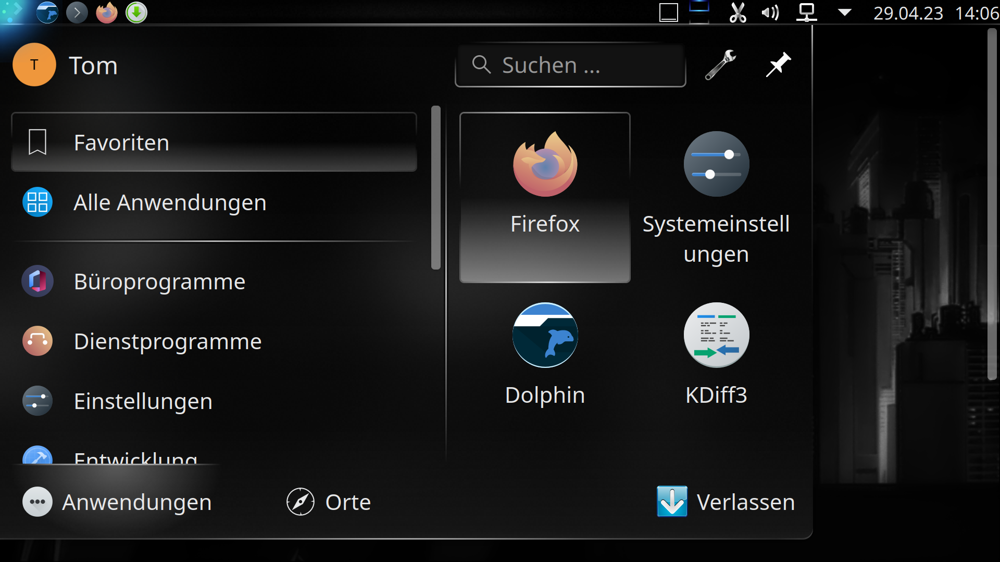
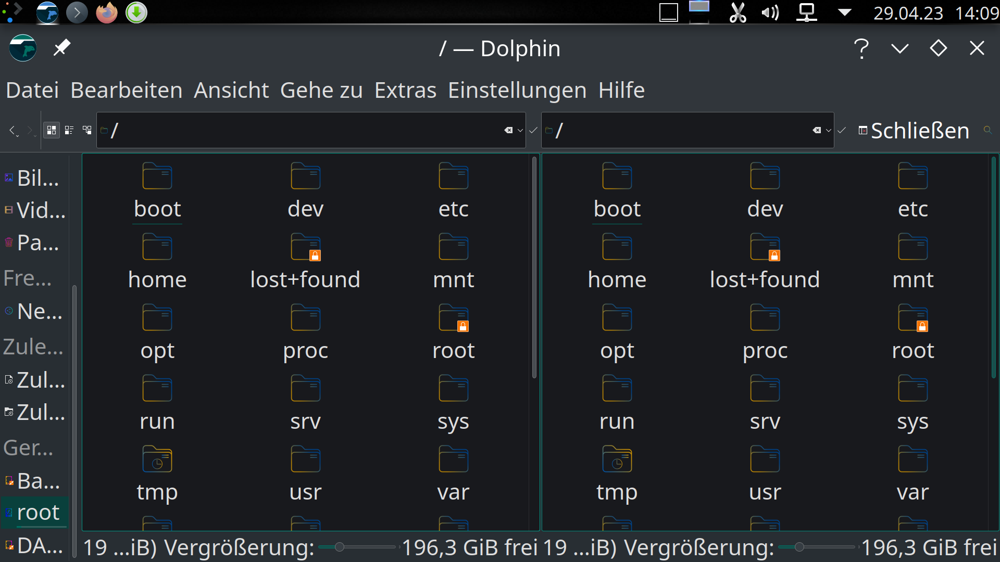
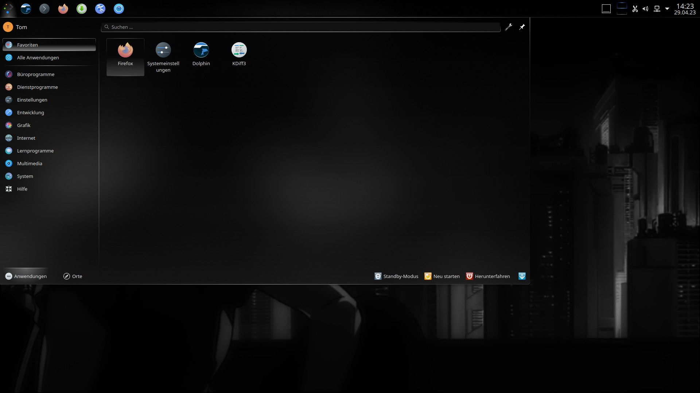
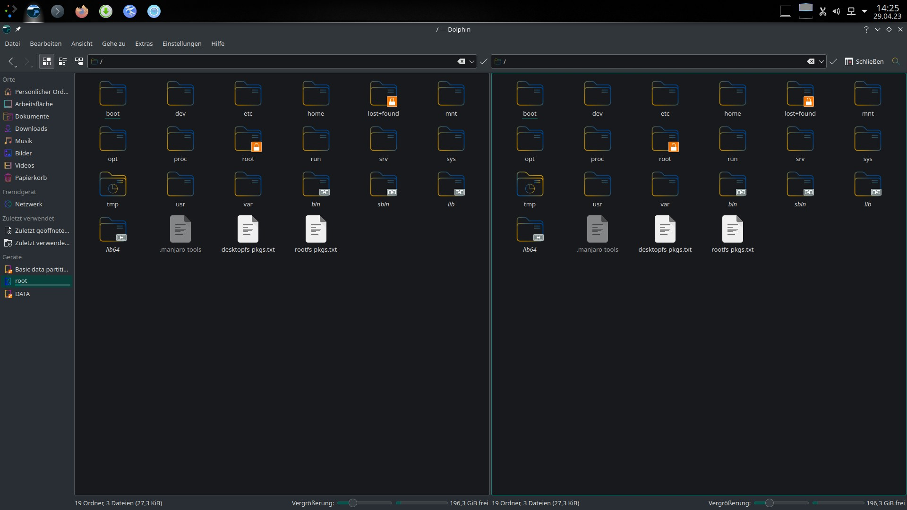

# KDE & Nvidia

If you try to use KDE with your Nvidia card with proprietary drivers, you may run into a scaling problem. Your desktop might look like the following:





As you can see, icons, fonts and almost everything are way to big, and the desktop is more or less unusable.

The solution is quite simple: open /etc/sddm.conf (e.g. with `sudo nano /etc/sddm.conf`) and add

```
-dpi 96
```

to the line

_**ServerArguments=-nolisten tcp**_

in section `[X11]`:

It should look like this (among other entries):

```
[X11]
ServerArguments=-nolisten tcp -dpi 96

```

After restarting your computer the scaling problem should be gone and your desktop look like this:




